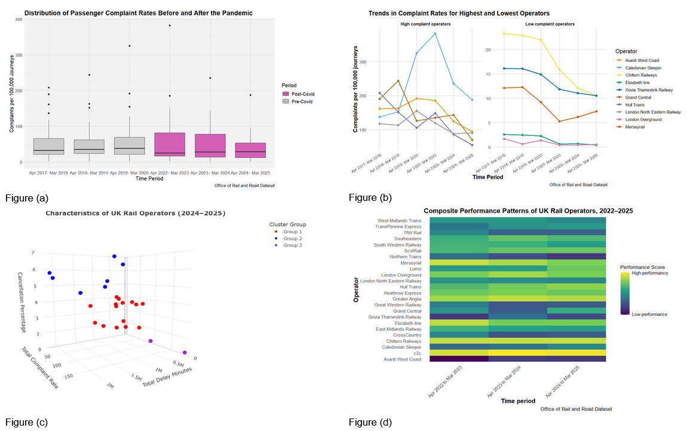

# Exploring Inequality In Performance Of Different Rail Operators In The UK (IJC445 Data Visualisation)

This project is dedicated to the module Data Visualisation, undertaken during the first semester of MSc Data Science at the University of Sheffield.

You can find the link to the code repository [here](https://github.com/yada-98/data-visualisation).

## Datasets used

The source of the data is Office of Rail and Road, from exploration of [data table catalogue](https://dataportal.orr.gov.uk/data-table-catalogue/).

Two datasets are studied under this project, namely
- Passenger rail service complaints - Table 4113 - Complaints per 100,000 journeys by operator
- TOC key statistics - Table 2200 - All operators

## Description

The composite visualisation explores inequality and variation in the performance of UK rail operators across time. It integrates multiple indicators such as delays, cancellations and passenger complaints. By combining multiple views, the visualisation enables comparison between operators and supports interpretation of both short-term fluctuations and long-term structural differences in performance, including patterns associated with the post-pandemic period.

## Key findings

- This composite visualisation shows the system-level inequality in operator performance, where a small number of operators perform poorly in terms of complaint, delays and cancellations. 
- By combining multiple views, it can help to distinguish between short-term disruptions and more structural differences.
- It also highlights patterns of the post-pandemic recovery. 

## Requirements

- R and RStudio (available at [https://posit.co/download/rstudio-desktop/](https://posit.co/download/rstudio-desktop/))

The following R packages are required:
- `plotly`
- `tidyverse`
- `readODS`

## Guide to code running

- The project only involves a single R file in the repository [VisualisationAssignment.R](VisualisationAssignment.R).
- After downloading the datasets from the source, please put them in the same directory as the R file.
- Explore the script from start to end in RStudio by executing each code block sequentially (e.g. by pasting each block to the RStudio console) to reproduce the analysis and results presented in the report.
